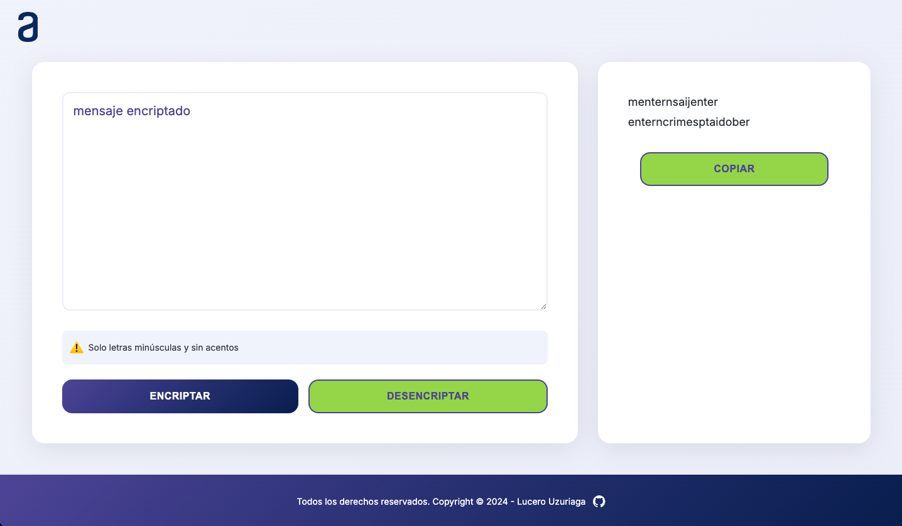

# 🔐 Challenge Encriptador de Texto


Aplicación web que encripta y desencripta texto utilizando un sistema de sustitución de caracteres. Desarrollado como parte del programa Oracle Next Education (ONE) de Alura Latam.

## 📋 Descripción

Este proyecto permite encriptar mensajes de texto utilizando un conjunto específico de reglas de sustitución, y posteriormente desencriptarlos para recuperar el mensaje original. La interfaz es intuitiva, responsive y moderna.

### Reglas de Encriptación

Las "llaves" de encriptación utilizadas son:

- La letra **"e"** se convierte en **"enter"**
- La letra **"i"** se convierte en **"imes"**
- La letra **"a"** se convierte en **"ai"**
- La letra **"o"** se convierte en **"ober"**
- La letra **"u"** se convierte en **"ufat"**

### Requisitos

- ✅ Solo funciona con letras minúsculas
- ✅ No se deben utilizar letras con acentos ni caracteres especiales
- ✅ Debe ser posible convertir una palabra encriptada a su versión original

**Ejemplos:**

```
"gato" => "gaitober"
"gaitober" => "gato"
```

## ✨ Características

- 🔒 Encriptación y desencriptación de texto
- 📋 Botón para copiar el texto encriptado/desencriptado al portapapeles
- 📱 Diseño responsive (mobile, tablet y desktop)
- 🎨 Interfaz moderna con animaciones suaves
- ⚠️ Validación de entrada (solo minúsculas sin acentos)
- 🎯 Feedback visual al usuario

## 🚀 Demo

[Ver Demo en Vivo](#) <!-- Agrega aquí el link de tu GitHub Pages o Vercel -->

## 📸 Capturas de Pantalla

### Vista Desktop



## 🛠️ Tecnologías Utilizadas

- **HTML5** - Estructura semántica
- **CSS3** - Estilos modernos con Flexbox y Grid
- **JavaScript** - Lógica de encriptación/desencriptación
- **Google Fonts** - Tipografía Inter

## 📁 Estructura del Proyecto

```
challenge-encriptador/
│
├── index.html
├── README.md
│
├── css/
│   └── style.css
│
├── js/
│   └── app.js
│
└── img/
│   ├── exclamation.svg
│   ├── favicon.ico
│   ├── github.svg
│   ├── home.png
│   └── logo_alura.svg
```

## 💻 Instalación y Uso

### Clonar el repositorio

```bash
git clone https://github.com/luuzuriaga/challenge-encriptador.git
```

### Navegar al directorio

```bash
cd challenge-encriptador
```

### Abrir en el navegador

Simplemente abre el archivo `index.html` en tu navegador preferido, o utiliza Live Server si estás en VS Code.

## 🎮 Cómo Usar

1. **Ingresa tu texto** en el área de texto principal (solo letras minúsculas sin acentos)
2. **Haz clic en "Encriptar"** para convertir tu mensaje
3. **Haz clic en "Desencriptar"** para recuperar el mensaje original
4. **Usa el botón "Copiar"** para copiar el resultado al portapapeles

## 🎨 Paleta de Colores

| Color | Hex | Uso |
|-------|-----|-----|
| Azul Oscuro | `#615AA8` | Botones principales |
| Azul Profundo | `#072B61` | Acentos |
| Azul Claro | `#F3F5FC` | Fondo |
| Verde Acento | `#A3DA58` | Botones secundarios |
| Gris | `#495057` | Texto secundario |

## 📱 Responsive Design

El proyecto está optimizado para diferentes tamaños de pantalla:

- 📱 **Mobile**: < 640px
- 📱 **Tablet**: 640px - 1023px
- 💻 **Desktop**: > 1024px

## 🤝 Contribuciones

Las contribuciones son bienvenidas. Si deseas mejorar este proyecto:

1. Fork el proyecto
2. Crea una rama para tu feature (`git checkout -b feature/AmazingFeature`)
3. Commit tus cambios (`git commit -m 'Add some AmazingFeature'`)
4. Push a la rama (`git push origin feature/AmazingFeature`)
5. Abre un Pull Request

## 📄 Licencia

Este proyecto está bajo la Licencia MIT. Ver el archivo `LICENSE` para más detalles.

## ✍️ Autor

**Lucero Uzuriaga**

- GitHub: [@luuzuriaga](https://github.com/luuzuriaga)
- LinkedIn: [Tu LinkedIn](#) <!-- Agrega tu link de LinkedIn -->

## 🙏 Agradecimientos

- [Alura Latam](https://www.aluracursos.com/) - Por el programa ONE
- [Oracle Next Education](https://www.oracle.com/br/education/oracle-next-education/) - Por la iniciativa educativa
- Comunidad de desarrolladores que comparten conocimiento

---

⭐️ Si te gustó este proyecto, ¡no olvides darle una estrella!

**Hecho con ❤️ por Lucero Uzuriaga - 2024**